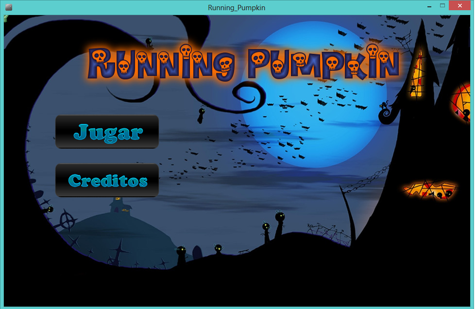
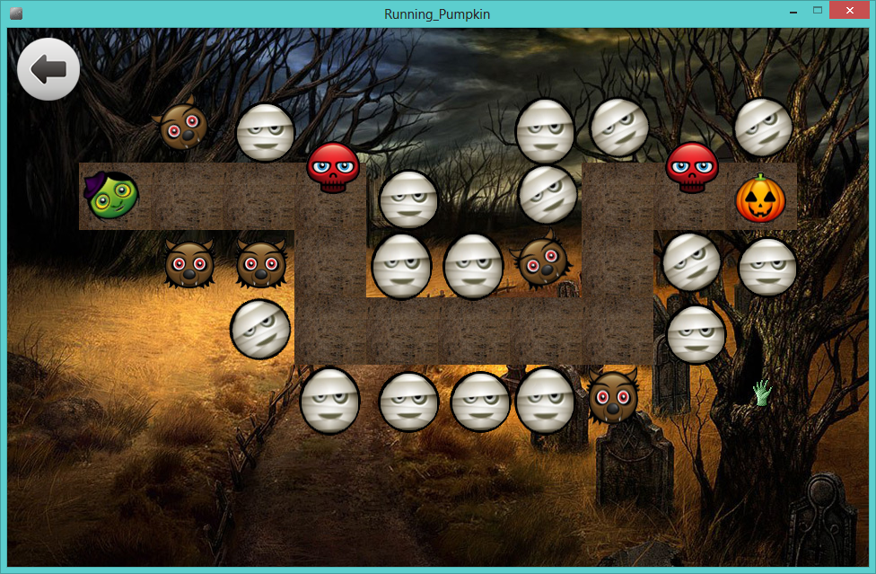

# Running Pumpkin

Running Pumpkin is an open-source game developed in Processing in mid-2012.

## Story

The witch Clare has decided to make a pumpkin pie for her sister Rita's birthday. So, she has ventured into the forest to gather the necessary ingredients. Along the way, she runs into several obstacles. She has enchanted a zombie's hand to bring her the main ingredient, so she can get everything else ready while the pumpkin arrives.

## Instructions
Carry the pumpkin from the right edge to the left edge, where Clare is located,
without being touched by the obstacles :)

## Team
A project originally developed by:

* Luis Mendoza      [@lmendev](https://x.com/lmendev)
* Adriana Gallon    [@apgallon](https://x.com/apgallon)
* Angelica Acosta   
